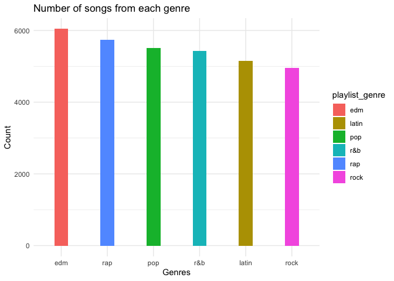
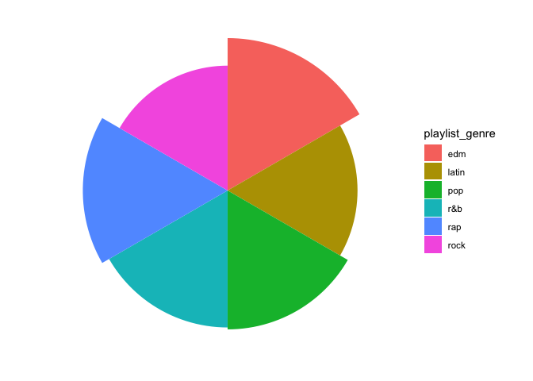
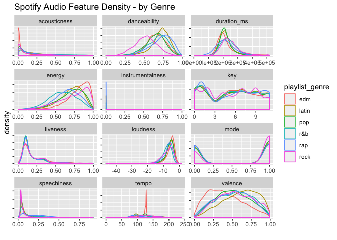
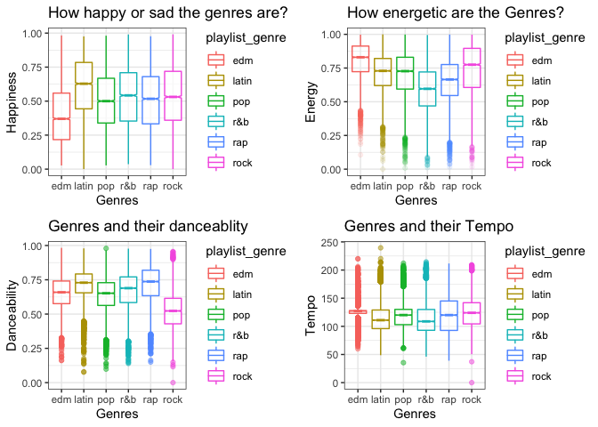
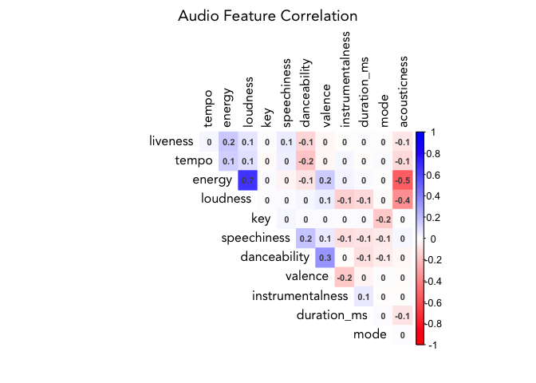
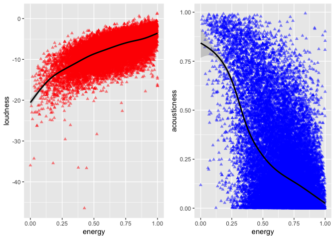
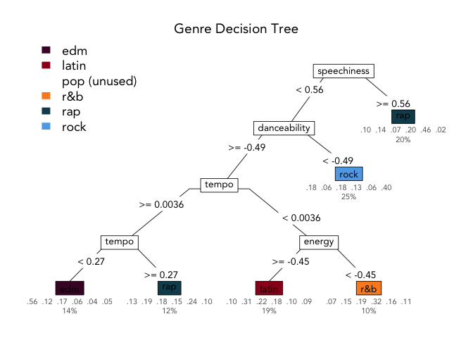

Spotify
================
Hardik Gupta
2020-04-04

### Problem Statement

The objective of this project is to explore various songs and to
classify them in to genres by analysing their audio features.This helps
music streaming services such as Spotify/Youtube and many other
platforms to create playlits and also make recommendations to their user
based on their preferences and also music they have listened to in past.

### Approach

The dataset used for our analysis has been extracted from Spotify using
the spotifyr package (<https://www.rcharlie.com/spotifyr/>), the dataset
inlcludes 12 audio feautures or dimension such as “arousal”, “valence”,
and “depth”, we further explain these features later in the document.
After tidying the data, I plan to use some visualization to understand
how each of the 12 audio features relate to each genre and various
artists, performing basic analysis on data, and then using data mining
techniques to classify songs in to various categories or genres.

### Proposed analytical technqiue

I will first perform data cleaning on the data set to find out any
missing values and then decide whether to delete or impute those, check
if their are any outliers in data if yes then how it might affect the
results and according decide to delete or keep it. For the purpose of
classification I will most probably be using decision tree, random
forest, and LDA\>

### How will it help the consumer?

Consumer can make use of the analysis to put songs in to broader genres
or categories which traditionally may not belong the same genre but have
similar features and that can be used to create custom playlists
suitable for a particular occasion or mood. Recommendations for new
songs from different genres/languages which have similar features such
as danceability, energy, valence etc can be made to a user depending on
their listening history and preferences.

data.table tidyverse randomForest rpart

``` r
# this package is used to read data files, is faster than readr package
library(data.table) 

# this package is used to get basic statistics of numerical variables using basicStats function
library(fBasics)

# it is a collection of multiple packages used to clean, visualise,model, and to communicate the data.
library(tidyverse) 

# this is used to genrate random forest(data mining technique) to model the data and classify the results.
library(randomForest) 

# this is used to generate decision trees which will help in classifying the data in to genres.
library(rpart) 

#to use ggarrange()
library(ggpubr)

#LDA function
library(MASS)
```

## Data Preparation

#### 3.1

The data comes from Spotify via the [spotifyr
package](https://www.rcharlie.com/spotifyr/). [Charlie
Thompson](https://twitter.com/_RCharlie), [Josiah
Parry](https://twitter.com/JosiahParry), Donal Phipps, and Tom Wolff
authored this package to make it easier to get either your own data or
general metadata arounds songs from Spotify’s API.

Data downloded from:
<https://www.dropbox.com/sh/qj0ueimxot3ltbf/AACzMOHv7sZCJsj3ErjtOG7ya?dl=1>

#### 3.1

#### Purpose

Spotifyr is only used to extract data, and users can extract and use
this data for various purposes. This package was published on 13th July,
2019.

For our analysis we will be using 12 audio features in the dataset
1.acousticness 2.liveness 3.speechiness 4.instrumentalness 5.energy
6.loudness 7.danceability 8.valence 9.duration 10.tempo 11.key 12.mode

#### 3.2

Original dataset extracted via this package has 23 variables as listed
below. Data importing is done using the fread() from data.table package
which is then stored in a data frame called songs.

We then check the variable names in the dataframe using names() function
which returns the column names.

First 6 observartions are displayed using the head() function.

``` r
#rerading dataset in to songs.
songs <- fread("spotify_songs.csv")
#checking variable or column names
names(songs)
```

    ##  [1] "track_id"                 "track_name"              
    ##  [3] "track_artist"             "track_popularity"        
    ##  [5] "track_album_id"           "track_album_name"        
    ##  [7] "track_album_release_date" "playlist_name"           
    ##  [9] "playlist_id"              "playlist_genre"          
    ## [11] "playlist_subgenre"        "danceability"            
    ## [13] "energy"                   "key"                     
    ## [15] "loudness"                 "mode"                    
    ## [17] "speechiness"              "acousticness"            
    ## [19] "instrumentalness"         "liveness"                
    ## [21] "valence"                  "tempo"                   
    ## [23] "duration_ms"

``` r
#displaying the first 6 observations.
head(songs)
```

    ##                  track_id
    ## 1: 6f807x0ima9a1j3VPbc7VN
    ## 2: 0r7CVbZTWZgbTCYdfa2P31
    ## 3: 1z1Hg7Vb0AhHDiEmnDE79l
    ## 4: 75FpbthrwQmzHlBJLuGdC7
    ## 5: 1e8PAfcKUYoKkxPhrHqw4x
    ## 6: 7fvUMiyapMsRRxr07cU8Ef
    ##                                               track_name     track_artist
    ## 1: I Don't Care (with Justin Bieber) - Loud Luxury Remix       Ed Sheeran
    ## 2:                       Memories - Dillon Francis Remix         Maroon 5
    ## 3:                       All the Time - Don Diablo Remix     Zara Larsson
    ## 4:                     Call You Mine - Keanu Silva Remix The Chainsmokers
    ## 5:               Someone You Loved - Future Humans Remix    Lewis Capaldi
    ## 6:     Beautiful People (feat. Khalid) - Jack Wins Remix       Ed Sheeran
    ##    track_popularity         track_album_id
    ## 1:               66 2oCs0DGTsRO98Gh5ZSl2Cx
    ## 2:               67 63rPSO264uRjW1X5E6cWv6
    ## 3:               70 1HoSmj2eLcsrR0vE9gThr4
    ## 4:               60 1nqYsOef1yKKuGOVchbsk6
    ## 5:               69 7m7vv9wlQ4i0LFuJiE2zsQ
    ## 6:               67 2yiy9cd2QktrNvWC2EUi0k
    ##                                         track_album_name
    ## 1: I Don't Care (with Justin Bieber) [Loud Luxury Remix]
    ## 2:                       Memories (Dillon Francis Remix)
    ## 3:                       All the Time (Don Diablo Remix)
    ## 4:                           Call You Mine - The Remixes
    ## 5:               Someone You Loved (Future Humans Remix)
    ## 6:     Beautiful People (feat. Khalid) [Jack Wins Remix]
    ##    track_album_release_date playlist_name            playlist_id
    ## 1:               2019-06-14     Pop Remix 37i9dQZF1DXcZDD7cfEKhW
    ## 2:               2019-12-13     Pop Remix 37i9dQZF1DXcZDD7cfEKhW
    ## 3:               2019-07-05     Pop Remix 37i9dQZF1DXcZDD7cfEKhW
    ## 4:               2019-07-19     Pop Remix 37i9dQZF1DXcZDD7cfEKhW
    ## 5:               2019-03-05     Pop Remix 37i9dQZF1DXcZDD7cfEKhW
    ## 6:               2019-07-11     Pop Remix 37i9dQZF1DXcZDD7cfEKhW
    ##    playlist_genre playlist_subgenre danceability energy key loudness mode
    ## 1:            pop         dance pop        0.748  0.916   6   -2.634    1
    ## 2:            pop         dance pop        0.726  0.815  11   -4.969    1
    ## 3:            pop         dance pop        0.675  0.931   1   -3.432    0
    ## 4:            pop         dance pop        0.718  0.930   7   -3.778    1
    ## 5:            pop         dance pop        0.650  0.833   1   -4.672    1
    ## 6:            pop         dance pop        0.675  0.919   8   -5.385    1
    ##    speechiness acousticness instrumentalness liveness valence   tempo
    ## 1:      0.0583       0.1020         0.00e+00   0.0653   0.518 122.036
    ## 2:      0.0373       0.0724         4.21e-03   0.3570   0.693  99.972
    ## 3:      0.0742       0.0794         2.33e-05   0.1100   0.613 124.008
    ## 4:      0.1020       0.0287         9.43e-06   0.2040   0.277 121.956
    ## 5:      0.0359       0.0803         0.00e+00   0.0833   0.725 123.976
    ## 6:      0.1270       0.0799         0.00e+00   0.1430   0.585 124.982
    ##    duration_ms
    ## 1:      194754
    ## 2:      162600
    ## 3:      176616
    ## 4:      169093
    ## 5:      189052
    ## 6:      163049

#### 3.3

There are total 32833 observations in 23 variables.

sum() and is.na() is used to get the sum of all the missing values in
the dataframe, there are 15 missing values in the data set. Next we
check where these missing values are in the dataset using apply() here
second parameter 2 indicates to search for missing values in columns
rather than rows and which() returns the indices where the missing
values are.

``` r
#checking the structure of the dataframe songs.
str(songs)
```

    ## Classes 'data.table' and 'data.frame':   32833 obs. of  23 variables:
    ##  $ track_id                : chr  "6f807x0ima9a1j3VPbc7VN" "0r7CVbZTWZgbTCYdfa2P31" "1z1Hg7Vb0AhHDiEmnDE79l" "75FpbthrwQmzHlBJLuGdC7" ...
    ##  $ track_name              : chr  "I Don't Care (with Justin Bieber) - Loud Luxury Remix" "Memories - Dillon Francis Remix" "All the Time - Don Diablo Remix" "Call You Mine - Keanu Silva Remix" ...
    ##  $ track_artist            : chr  "Ed Sheeran" "Maroon 5" "Zara Larsson" "The Chainsmokers" ...
    ##  $ track_popularity        : int  66 67 70 60 69 67 62 69 68 67 ...
    ##  $ track_album_id          : chr  "2oCs0DGTsRO98Gh5ZSl2Cx" "63rPSO264uRjW1X5E6cWv6" "1HoSmj2eLcsrR0vE9gThr4" "1nqYsOef1yKKuGOVchbsk6" ...
    ##  $ track_album_name        : chr  "I Don't Care (with Justin Bieber) [Loud Luxury Remix]" "Memories (Dillon Francis Remix)" "All the Time (Don Diablo Remix)" "Call You Mine - The Remixes" ...
    ##  $ track_album_release_date: chr  "2019-06-14" "2019-12-13" "2019-07-05" "2019-07-19" ...
    ##  $ playlist_name           : chr  "Pop Remix" "Pop Remix" "Pop Remix" "Pop Remix" ...
    ##  $ playlist_id             : chr  "37i9dQZF1DXcZDD7cfEKhW" "37i9dQZF1DXcZDD7cfEKhW" "37i9dQZF1DXcZDD7cfEKhW" "37i9dQZF1DXcZDD7cfEKhW" ...
    ##  $ playlist_genre          : chr  "pop" "pop" "pop" "pop" ...
    ##  $ playlist_subgenre       : chr  "dance pop" "dance pop" "dance pop" "dance pop" ...
    ##  $ danceability            : num  0.748 0.726 0.675 0.718 0.65 0.675 0.449 0.542 0.594 0.642 ...
    ##  $ energy                  : num  0.916 0.815 0.931 0.93 0.833 0.919 0.856 0.903 0.935 0.818 ...
    ##  $ key                     : int  6 11 1 7 1 8 5 4 8 2 ...
    ##  $ loudness                : num  -2.63 -4.97 -3.43 -3.78 -4.67 ...
    ##  $ mode                    : int  1 1 0 1 1 1 0 0 1 1 ...
    ##  $ speechiness             : num  0.0583 0.0373 0.0742 0.102 0.0359 0.127 0.0623 0.0434 0.0565 0.032 ...
    ##  $ acousticness            : num  0.102 0.0724 0.0794 0.0287 0.0803 0.0799 0.187 0.0335 0.0249 0.0567 ...
    ##  $ instrumentalness        : num  0.00 4.21e-03 2.33e-05 9.43e-06 0.00 0.00 0.00 4.83e-06 3.97e-06 0.00 ...
    ##  $ liveness                : num  0.0653 0.357 0.11 0.204 0.0833 0.143 0.176 0.111 0.637 0.0919 ...
    ##  $ valence                 : num  0.518 0.693 0.613 0.277 0.725 0.585 0.152 0.367 0.366 0.59 ...
    ##  $ tempo                   : num  122 100 124 122 124 ...
    ##  $ duration_ms             : int  194754 162600 176616 169093 189052 163049 187675 207619 193187 253040 ...
    ##  - attr(*, ".internal.selfref")=<externalptr>

``` r
#summing the total na values in songs.
sum(is.na(songs))
```

    ## [1] 15

``` r
#finding out where these missing values are.

apply(is.na(songs), 2, which)
```

    ## $track_id
    ## integer(0)
    ## 
    ## $track_name
    ## [1]  8152  9283  9284 19569 19812
    ## 
    ## $track_artist
    ## [1]  8152  9283  9284 19569 19812
    ## 
    ## $track_popularity
    ## integer(0)
    ## 
    ## $track_album_id
    ## integer(0)
    ## 
    ## $track_album_name
    ## [1]  8152  9283  9284 19569 19812
    ## 
    ## $track_album_release_date
    ## integer(0)
    ## 
    ## $playlist_name
    ## integer(0)
    ## 
    ## $playlist_id
    ## integer(0)
    ## 
    ## $playlist_genre
    ## integer(0)
    ## 
    ## $playlist_subgenre
    ## integer(0)
    ## 
    ## $danceability
    ## integer(0)
    ## 
    ## $energy
    ## integer(0)
    ## 
    ## $key
    ## integer(0)
    ## 
    ## $loudness
    ## integer(0)
    ## 
    ## $mode
    ## integer(0)
    ## 
    ## $speechiness
    ## integer(0)
    ## 
    ## $acousticness
    ## integer(0)
    ## 
    ## $instrumentalness
    ## integer(0)
    ## 
    ## $liveness
    ## integer(0)
    ## 
    ## $valence
    ## integer(0)
    ## 
    ## $tempo
    ## integer(0)
    ## 
    ## $duration_ms
    ## integer(0)

``` r
#this function is giving an error when I knit the html file, while it works fine when I run it normally. This is giving the column names and row number where the missing values are. I am not sure how to resolve it.


#summarising the data mean, min and max for numerical variables.
options(digits = 2)# limiting the decimal digits to 2


#getting all the numeric variables/columns in numsongs
numsongs <- songs[,sapply(songs, is.numeric), with= FALSE] 
#getting expeceted value and range.
stat <- basicStats(numsongs)[c("Mean","Minimum", "Maximum"),]
```

We can see observation numbers 8152, 9283, 9284, 19569, and 19812 have
missing values in columns “track\_name”, “track\_artist”, and
“track\_album\_name”. All the information for these 4 observation
related to names of songs and artists have been missed. This shouldn’t
really be a problem in our analysis as we have all the necessary
information required to classify a song to a particular genre.

The data is clean and there is hardly anything we need to do, missing
values will not affect our analysis as explained above.

#### Deleting columns

Deleting columns track\_id, track\_album\_id, track\_album\_name,
track\_album\_release\_date, and playlist\_id as we will not be needing
these columns for any of our analysis.

``` r
songs$track_id = NULL
songs$track_album_id = NULL
songs$track_album_name = NULL
songs$track_album_release_date = NULL
songs$playlist_id = NULL
```

#### 3.4

Displaying the first few observations of the dataset to give an idea of
what the data looks
like

``` r
songs %>% head() %>% knitr::kable()
```

| track\_name                                           | track\_artist    | track\_popularity | playlist\_name | playlist\_genre | playlist\_subgenre | danceability | energy | key | loudness | mode | speechiness | acousticness | instrumentalness | liveness | valence | tempo | duration\_ms |
| :---------------------------------------------------- | :--------------- | ----------------: | :------------- | :-------------- | :----------------- | -----------: | -----: | --: | -------: | ---: | ----------: | -----------: | ---------------: | -------: | ------: | ----: | -----------: |
| I Don’t Care (with Justin Bieber) - Loud Luxury Remix | Ed Sheeran       |                66 | Pop Remix      | pop             | dance pop          |         0.75 |   0.92 |   6 |    \-2.6 |    1 |        0.06 |         0.10 |                0 |     0.07 |    0.52 |   122 |       194754 |
| Memories - Dillon Francis Remix                       | Maroon 5         |                67 | Pop Remix      | pop             | dance pop          |         0.73 |   0.82 |  11 |    \-5.0 |    1 |        0.04 |         0.07 |                0 |     0.36 |    0.69 |   100 |       162600 |
| All the Time - Don Diablo Remix                       | Zara Larsson     |                70 | Pop Remix      | pop             | dance pop          |         0.68 |   0.93 |   1 |    \-3.4 |    0 |        0.07 |         0.08 |                0 |     0.11 |    0.61 |   124 |       176616 |
| Call You Mine - Keanu Silva Remix                     | The Chainsmokers |                60 | Pop Remix      | pop             | dance pop          |         0.72 |   0.93 |   7 |    \-3.8 |    1 |        0.10 |         0.03 |                0 |     0.20 |    0.28 |   122 |       169093 |
| Someone You Loved - Future Humans Remix               | Lewis Capaldi    |                69 | Pop Remix      | pop             | dance pop          |         0.65 |   0.83 |   1 |    \-4.7 |    1 |        0.04 |         0.08 |                0 |     0.08 |    0.72 |   124 |       189052 |
| Beautiful People (feat. Khalid) - Jack Wins Remix     | Ed Sheeran       |                67 | Pop Remix      | pop             | dance pop          |         0.68 |   0.92 |   8 |    \-5.4 |    1 |        0.13 |         0.08 |                0 |     0.14 |    0.58 |   125 |       163049 |

### Detailed explanation of 12 audio features which we will be using for our analysis

1.  danceability - Danceability describes how suitable a track is for
    dancing based on a combination of musical elements including tempo,
    rhythm stability, beat strength, and overall regularity. A value of
    0.0 is least danceable and 1.0 is most danceable.

2.  energy - Energy is a measure from 0.0 to 1.0 and represents a
    perceptual measure of intensity and activity. Typically, energetic
    tracks feel fast, loud, and noisy. For example, death metal has high
    energy, while a Bach prelude scores low on the scale. Perceptual
    features contributing to this attribute include dynamic range,
    perceived loudness, timbre, onset rate, and general entropy.

3.  key - The estimated overall key of the track. Integers map to
    pitches using standard Pitch Class notation . E.g. 0 = C, 1 = C♯/D♭,
    2 = D, and so on. If no key was detected, the value is -1.

4.  loudness - The overall loudness of a track in decibels (dB).
    Loudness values are averaged across the entire track and are useful
    for comparing relative loudness of tracks. Loudness is the quality
    of a sound that is the primary psychological correlate of physical
    strength (amplitude). Values typical range between -60 and 0 db.

5.  mode - Mode indicates the modality (major or minor) of a track, the
    type of scale from which its melodic content is derived. Major is
    represented by 1 and minor is 0.

6.  speechiness - Speechiness detects the presence of spoken words in a
    track. The more exclusively speech-like the recording (e.g. talk
    show, audio book, poetry), the closer to 1.0 the attribute value.
    Values above 0.66 describe tracks that are probably made entirely of
    spoken words. Values between 0.33 and 0.66 describe tracks that may
    contain both music and speech, either in sections or layered,
    including such cases as rap music. Values below 0.33 most likely
    represent music and other non-speech-like tracks.

7.  acousticness - A confidence measure from 0.0 to 1.0 of whether the
    track is acoustic. 1.0 represents high confidence the track is
    acoustic.

8.  instrumentalness - Predicts whether a track contains no vocals.
    “Ooh” and “aah” sounds are treated as instrumental in this
    context. Rap or spoken word tracks are clearly “vocal”. The closer
    the instrumentalness value is to 1.0, the greater likelihood the
    track contains no vocal content. Values above 0.5 are intended to
    represent instrumental tracks, but confidence is higher as the value
    approaches 1.0.

9.  liveness - Detects the presence of an audience in the recording.
    Higher liveness values represent an increased probability that the
    track was performed live. A value above 0.8 provides strong
    likelihood that the track is live.

10. valence - A measure from 0.0 to 1.0 describing the musical
    positiveness conveyed by a track. Tracks with high valence sound
    more positive (e.g. happy, cheerful, euphoric), while tracks with
    low valence sound more negative (e.g. sad, depressed, angry).

11. tempo - The overall estimated tempo of a track in beats per minute
    (BPM). In musical terminology, tempo is the speed or pace of a given
    piece and derives directly from the average beat duration.

12. duration\_ms - Duration of song in milliseconds

### Exploratory Data Analysis

#### 4.1

#### Count of songs from each genre

Checking the total number of songs from each genre using ggplot and then
summarizing it in a table.

``` r
#plotting count of each genre
songs %>% ggplot(aes(x = fct_infreq(playlist_genre) , fill = playlist_genre))+
  geom_bar(width=0.3)+
  labs(title = 'Number of songs from each genre', x= 'Genres', y = 'Count' )+
  theme_minimal()
```

<!-- -->

``` r
#pie-chart
songs %>% ggplot(aes(x = playlist_genre, fill = playlist_genre))+
  geom_bar(width=1)+
  coord_polar()+
  theme_void()
```

<!-- -->

``` r
 songs %>% 
  count(playlist_genre) %>%
  knitr::kable()
```

| playlist\_genre |    n |
| :-------------- | ---: |
| edm             | 6043 |
| latin           | 5155 |
| pop             | 5507 |
| r\&b            | 5431 |
| rap             | 5746 |
| rock            | 4951 |

### Denisty Plots - Audio features of genres

Here, I have plotted density plots of the audio features of all the
genres, which basically tells us how the each genre is related with each
individual audio feature, and how relevant that particular feature is in
defining that genre.

``` r
#extracting all the audio feature columns
feature_names <- names(songs)[7:18]

songs %>%
  dplyr::select(c('playlist_genre', feature_names)) %>%
  pivot_longer(cols = feature_names) %>%
  ggplot(aes(x = value)) +
  geom_density(aes(color = playlist_genre), alpha = 0.5) +
  facet_wrap(~name, ncol = 3, scales = 'free') +
  labs(title = 'Spotify Audio Feature Density - by Genre',
       x = '', y = 'density') +
  theme(axis.text.y = element_blank())
```

<!-- --> \#\#\#
Observations : 1. EDM tracks are least likely to be acoustic, high on
energy, and low on valence (sad) as compared to other genres. 2. Latin
tracks have high danceability and high valence (happier). 3. Rock songs
are least likely to be danceable as compared to other genres. 4. Rap
scores high on speechiness as one would expect, which means it has more
spoken words.

As per our denisty plots the following features will provide us the most
seperation amongst the genres: 1. Valence 2. Energy 3. Danceability, and
maybe 4. Tempo

So i’ll focus on these features and explore more details about them.

### Boxplots of audio features of interest

Plotting the boxplots of genres against above mentioned 4 audio
features.

``` r
#Valence
p1 <- songs %>% ggplot(aes(x = playlist_genre, y = valence, color = playlist_genre)) +
  geom_boxplot(alpha = 0.7, notch = TRUE) +
  theme_bw() +
  labs(title = 'How happy or sad the genres are?', x= 'Genres', y = 'Happiness' )

#Energy

p2 <- songs %>% ggplot(aes(x = playlist_genre, y = energy, color = playlist_genre)) +
  geom_boxplot(alpha = 0.1, notch = TRUE) +
  theme_bw() +
  labs(title = 'How energetic are the Genres?', x= 'Genres', y = 'Energy' )

#Danceability
p3 <- songs %>% ggplot(aes(x = playlist_genre, y = danceability, color = playlist_genre)) +
  geom_boxplot(alpha = 0.5, notch = TRUE) +
  theme_bw() +
  labs(title = 'Genres and their danceablity', x= 'Genres', y = 'Danceability' )

#Tempo
p4 <- songs %>% ggplot(aes(x = playlist_genre, y = tempo, color = playlist_genre)) +
  geom_boxplot(alpha = 0.5, notch = TRUE) +
  theme_bw() +
  labs(title = 'Genres and their Tempo', x= 'Genres', y = 'Tempo' )

ggarrange(p1,p2,p3,p4 , nrow = 2, ncol = 2)
```

<!-- -->

### Insights obtained from density and boxplots.

How does boxplots and density plots together help us understand generes
and their features?

1.  Valence - As observed in the density plot valence can provide us a
    good seperation between EDM and Latin tracks as their is a
    comsiderable difference between their medial values and range, while
    all other genres have somewhat similar valence.

2.  Energy - Latin and Pop tracks have similar range and median values
    so energy might not be a good seperator for them while the remaining
    4 genres have a decent seperation on energy.

3.  Danceability - As density plots show Rock has the lowest
    danceability score while Latin tracks are more closely packed with
    the high danceability scores and Rap have a little more variability
    than latin tracks but in general have high danceability score.

4.  Tempo - It might do a good job of seperating EDM tracks from the
    rest of the genres as most of the EDM tracks are clustered around
    125 while other genres have more or less a similar spread and
    variability.

### Plotting correlations between audio features to check if there is any redundancy

``` r
songs %>%
  dplyr::select(feature_names) %>%
  scale() %>%
  cor() %>%
  corrplot::corrplot(method = 'color', 
                     order = 'hclust', 
                     type = 'upper', 
                     diag = FALSE, 
                     tl.col = 'black',
                     addCoef.col = "grey30",
                     number.cex = .7,
                     col = colorRampPalette(colors = c('red','white','blue'))(200),
                     main = 'Audio Feature Correlation',
                     mar = c(2,2,2,2),
                     family = 'Avenir',
                     number.digits = 1.
                     
                     )
```

<!-- -->

Correlation between energy and loudness, and energy and acousticness
seems to be on the higher side so we will explore it further.

``` r
tibble(variable = 'energy', loudness = 0.7, acousticness = -0.5)
```

    ## # A tibble: 1 x 3
    ##   variable loudness acousticness
    ##   <chr>       <dbl>        <dbl>
    ## 1 energy        0.7         -0.5

### Scatterplots Energy vs Loudness and Energy vs Acousticness

Plotting scatterplots to understand the correlation better.

``` r
s1 <- songs %>% ggplot(aes(energy,loudness)) +
  geom_point(color = 'red', alpha = .5, shape = 17) +
  geom_smooth(color = 'black')

s2 <- songs %>% ggplot(aes(energy,acousticness)) +
  geom_point(color = 'blue', alpha = .5, shape = 17) +
  geom_smooth(color = 'black')

ggarrange(s1,s2)
```

    ## `geom_smooth()` using method = 'gam' and formula 'y ~ s(x, bs = "cs")'
    ## `geom_smooth()` using method = 'gam' and formula 'y ~ s(x, bs = "cs")'

<!-- -->

We can see that as loudness(dB) of the song increase so does the energy,
and with the decrease in acousticness there is an increase in energy
though this pattern is not very linear but neverthless there is an
observable negative correlation.

Thus via density plots, boxplots and correlation graphs we can infer
that loudness will not help much in our prediction as energy gives us
better seperation. We will discard loudness.

## Modeling

### Scaling the data and dividing it in to training and testing

``` r
#Scaling
songs_scaled <-  songs%>%
  mutate_if(is.numeric, scale)


set.seed(4715)
#Training - Testing
id_train <- sample(nrow(songs_scaled),nrow(songs_scaled)*0.80)
songs.train = songs_scaled[id_train,]
songs.test = songs_scaled[-id_train,]

#extracting playlist_genre column
train_resp <- songs_scaled[id_train, 'playlist_genre']
test_resp <- songs_scaled[-id_train, 'playlist_genre']


#creating a function to calculate model accuracy
model_accuracy_calc <- function(df, model_name) {
  df %>% 
    mutate(match = ifelse(true_value == predicted_value, TRUE, FALSE)) %>% 
    count(match) %>% 
    mutate(accuracy = n/sum(n),
           model = model_name)
}
```

### Linear Discrimant Analysis

First up we will use LDA to see how it performs on the data

``` r
#Using lda function from MASS package

songs.lda <- lda(playlist_genre~ valence+energy+danceability+tempo+speechiness,data=songs.train)

#checking the fitted model
songs.lda
```

    ## Call:
    ## lda(playlist_genre ~ valence + energy + danceability + tempo + 
    ##     speechiness, data = songs.train)
    ## 
    ## Prior probabilities of groups:
    ##   edm latin   pop   r&b   rap  rock 
    ##  0.19  0.16  0.17  0.16  0.18  0.15 
    ## 
    ## Group means:
    ##       valence energy danceability   tempo speechiness
    ## edm    -0.471  0.571       0.0017  0.1795      -0.203
    ## latin   0.403  0.056       0.4010 -0.0880      -0.039
    ## pop    -0.024  0.014      -0.1027 -0.0039      -0.323
    ## r&b     0.078 -0.595       0.0975 -0.2473       0.099
    ## rap    -0.027 -0.262       0.4334 -0.0133       0.898
    ## rock    0.103  0.198      -0.9365  0.1405      -0.486
    ## 
    ## Coefficients of linear discriminants:
    ##                 LD1   LD2   LD3    LD4    LD5
    ## valence      -0.198 -0.84  0.30 -0.717 -0.041
    ## energy       -0.328  0.86 -0.08 -0.511  0.373
    ## danceability  0.735  0.67  0.69  0.091 -0.179
    ## tempo        -0.015  0.20 -0.10 -0.158 -0.999
    ## speechiness   0.779 -0.11 -0.71 -0.327  0.177
    ## 
    ## Proportion of trace:
    ##    LD1    LD2    LD3    LD4    LD5 
    ## 0.5748 0.3082 0.0816 0.0351 0.0003

``` r
#predicting the training data
pred.lda <- predict(songs.lda,data=songs.train)

#tabulating the predicted and observed values
table(songs.train$playlist_genre,pred.lda$class,dnn=c("Obs","Pred"))
```

    ##        Pred
    ## Obs      edm latin  pop  r&b  rap rock
    ##   edm   2945   591  283  200  375  468
    ##   latin  798  1526  280  495  674  331
    ##   pop   1170   780  558  687  330  831
    ##   r&b    388   767  303 1397  947  510
    ##   rap    725   528  129  602 2458  227
    ##   rock   552   310  260  492   50 2299

``` r
#misclassification rate
mean(ifelse(songs.train$playlist_genre != pred.lda$class, 1, 0))
```

    ## [1] 0.57

We decided to use Valence, Energy, Tempo, Danceability, and Speechiness
as our predictors, our model was able to correctly classify 43% of the
data.

### LDA on Test Data

``` r
pred.lda.test <- predict(songs.lda,data=songs.test)

mean(ifelse(songs.test$playlist_genre != pred.lda.test$class, 1, 0))
```

    ## Warning in `!=.default`(songs.test$playlist_genre, pred.lda.test$class):
    ## longer object length is not a multiple of shorter object length

    ## Warning in is.na(e1) | is.na(e2): longer object length is not a multiple of
    ## shorter object length

    ## [1] 0.84

Misclassification rate of 83% which means we could only classify 17% of
the songs
correctly.

### Decision Tree

``` r
model_dt <- rpart(playlist_genre ~ valence+energy+danceability+tempo+speechiness , data = songs.train)

rpart.plot::rpart.plot(model_dt, 
           type = 5, 
           extra = 104,
           box.palette = list(purple = "#490B32",
               red = "#9A031E",
               orange = '#FB8B24',
               dark_blue = "#0F4C5C",
               blue = "#5DA9E9",
               grey = '#66717E'),
           leaf.round = 0,
           fallen.leaves = FALSE, 
           branch = 0.3, 
           under = TRUE,
           under.col = 'grey40',
           family = 'Avenir',
           main = 'Genre Decision Tree',
           tweak = 1.2)
```

<!-- -->

1.  According to the tree Speechiness is the most important feature
    seperaring Rap from rest of the genres, tracks with low danceability
    are classified as Rock.

2.  High Tempo tracks are either classified as EDM or RAP with higher
    tempo songs being classified as Rap, this observation is inline with
    out Boxplot as it shows that both rap and edm have high tempo while
    rap has a larger range, edm tracks are closely packed around their
    mean.

3.  Values under the leafs represents the true values of each genre
    grouped in to that leaf, for example 10% EDM tracks, 14% latin, 7%
    pop, 20% R\&B, 46% Rap, and 2% Rock have been classified as Rap.
    Similar for all the other leaves.

4.  Best classification was achieved for EDM with 56% correctly
    classified and second best was Rap with 46%.

### Decision Tree on test data

``` r
predict_dt <- predict(object = model_dt, newdata = songs.test)
max_id <- apply(predict_dt, 1, which.max)
pred <- levels(as.factor(songs.test$playlist_genre))[max_id]

compare_dt <- data.frame(true_value = songs.test$playlist_genre,
                         predicted_value = pred,
                         model = 'decision_tree',
                         stringsAsFactors = FALSE)


accuracy_dt <- model_accuracy_calc(df = compare_dt, model_name = 'decision_tree')
accuracy_dt
```

    ## # A tibble: 2 x 4
    ##   match     n accuracy model        
    ##   <lgl> <int>    <dbl> <chr>        
    ## 1 FALSE  4105    0.625 decision_tree
    ## 2 TRUE   2462    0.375 decision_tree

We get a classification rate of 38% on out test data which is lower from
our
previous

### Random Forest

``` r
model_rf <- randomForest(as.factor(playlist_genre) ~ valence+energy+danceability+tempo+speechiness , ntree = 100, importance = TRUE, data = songs.train)

predict_rf <- predict(model_rf, songs.test)

compare_rf <- data.frame(true_value = test_resp,
                         predicted_value = predict_rf,
                         model = 'random_forest',
                         stringsAsFactors = FALSE) 

accuracy_rf <- model_accuracy_calc(df = compare_rf, model_name = 'random_forest')
accuracy_rf
```

    ## # A tibble: 2 x 4
    ##   match     n accuracy model        
    ##   <lgl> <int>    <dbl> <chr>        
    ## 1 FALSE  3329    0.507 random_forest
    ## 2 TRUE   3238    0.493 random_forest

Surprisingly Random Forest gives us an accuracy rate of ~50% on test
data.

### Summary

1.  I tried to classify the songs based on their audio features, which
    is a very imporant aspect for any music streaming service as this
    helps them to create playlists and make recommendations to their
    user.

2.  I started with some basic exploratory data analysis, and plotted
    some density plots which helped me figure out what features will be
    the most important for our classificiation.

3.  Boxplots were plotted of the important audio features from previous
    step and insights from boxplots were similar to ones from density
    plots and provided more information on the spread of the features in
    each of the genres.

4.  Spotify data was then divided in to 80% testing data and 20%
    trraining data on which LDA, Decision Trees and Random Forest models
    were applied.

5.  Random Forest gave us the best classification rate of ~50% on the
    test data.

6.  One really interesting observation from correlation graph of audio
    features was that Danceability is negatively correlated with tempo
    and energy though the negative correlation is not very high.

7.  We could also try to single out some genres instead of predicting
    all 6 and see which features would be most relevant and how that
    improves our classification over classifying all the 6 genres in one
    model.
